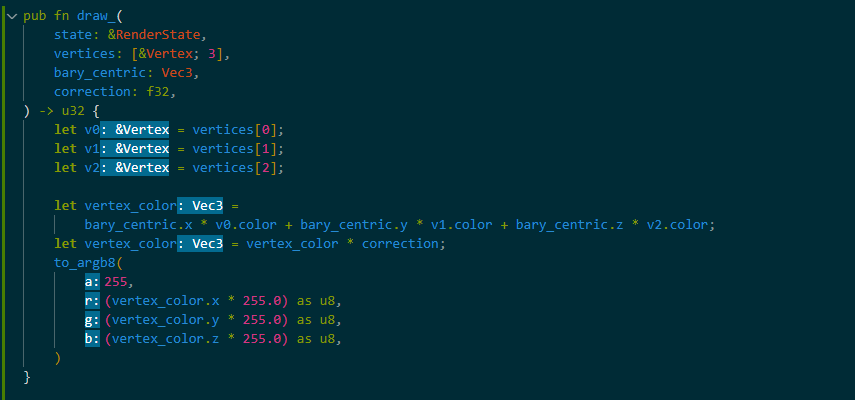
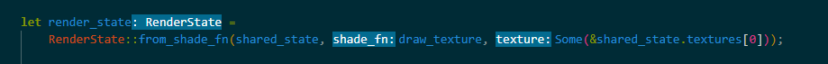

# Title
Name: Wessel Frijters 

BUas email: 200156@buas.nl

## Features
> Provide a detailed list of the features implemented
> Feel free to provide link to the code that implements te features. (in GitHub you can just click on a line of code and get the link to it)

+ Hot Reloading 
+ Shader Pipeline

## Showcase
> Provide screenshots/videos/gifs to showcase your software rasterizer.  
> Make sure to showcase the coolest features implemented and mention what each media is showcasing.  
> If you want to use videos, it's recommended to upload them on youtube instead of github and just embed them in this Markdown file.

### Final Result:
[video](https://www.youtube.com/shorts/WDwWc888Pxo)

### Shading Pipeline:
Shade Function:

Pipeline Setup:
